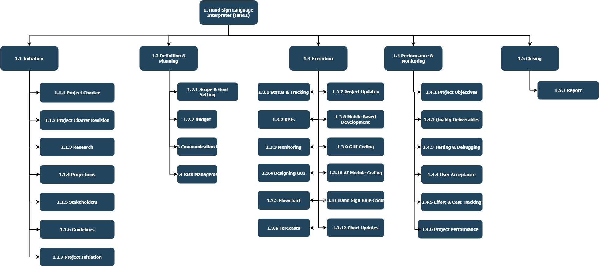
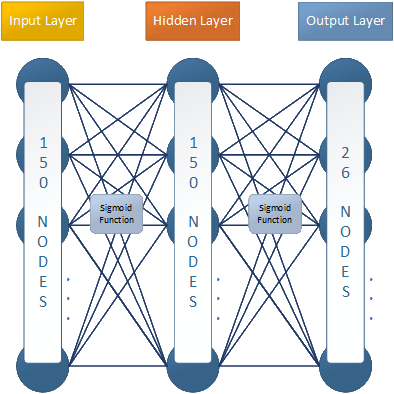
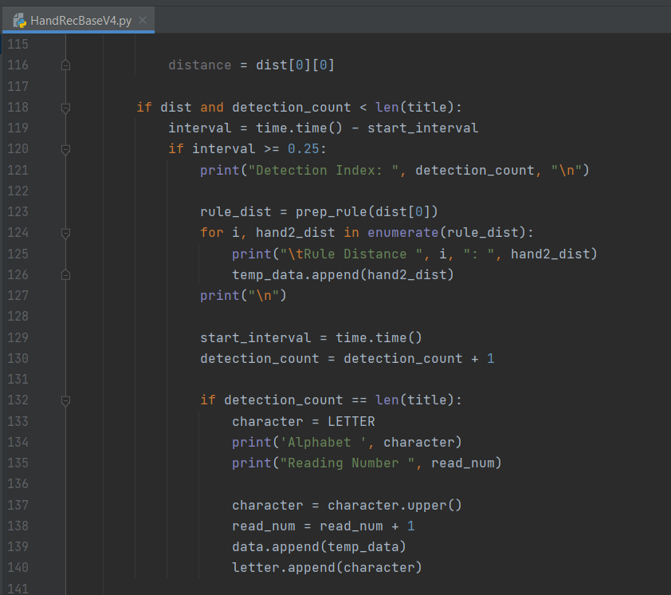
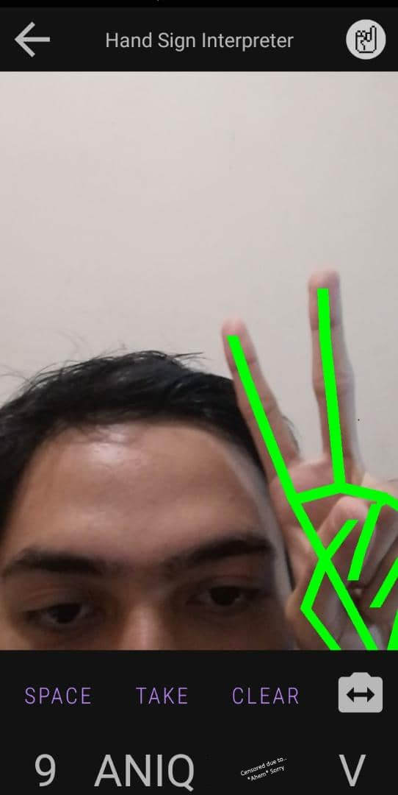
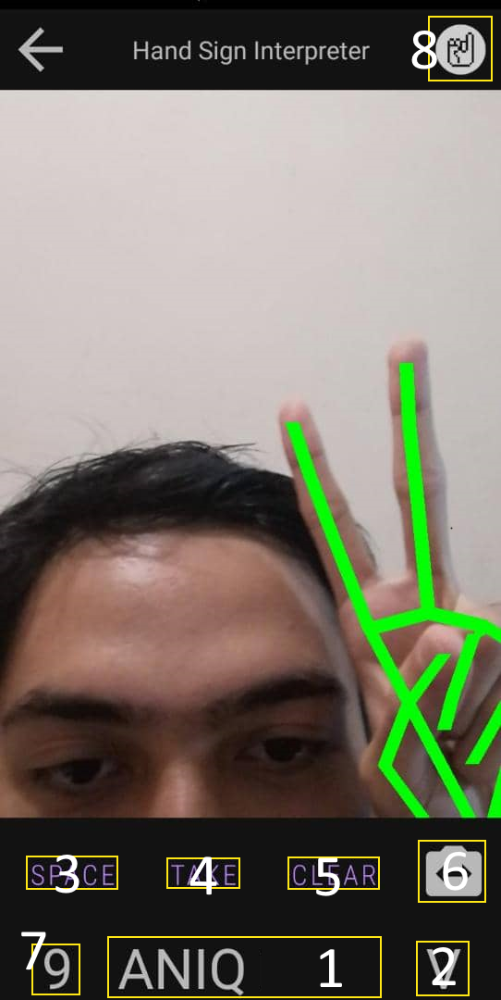

# Hand Sign Language Entepreter (HaSLI)

## A. DEFINING THE PROJECT

  
   
  Developed by Ad Astra Sdn. Bhd.

Lecturer : Prof. Dr. Goh Ong Sing

Project Manager: Ahmad Syazani Aniq bin Ahmad Khaizi (B031910153)
Project Members: 
  1) Hasif bin Mohamad Noh (B031910102)
  2) Muhammad Naqib Hakimi bin Hakmal (B031910407)
  3) Aiman Faris b. Mazri (B031910126)
  
<table>
    <thead>
        <tr>
            <th></th>
            <th>Name</th>
            <th>Matric Num.</th>
        </tr>
    </thead>
    <tbody>
        <tr>
            <td>Project Manager</td>
            <td>Ahmad Syazani Aniq bin Ahmad Khaizi</td>
            <td>B031910153</td>
        </tr>
        <tr>
            <td></td>
            <td>Hasif bin Mohamad Noh</td>
            <td>B031910102</td>
        </tr>
        <tr>
            <td>Project Member</td>
            <td>Muhammad Naqib Hakimi bin Hakmal</td>
            <td>B031910407</td>
        </tr>
        <tr>
            <td></td>
            <td>Aiman Faris b. Mazri</td>
            <td>B031910126</td>
        </tr>
    </tbody>
</table>

Download the [APK File](https://drive.google.com/file/d/1VqzHEgbA8BqpSgVJruktaNIwynxj16w1/view?usp=sharing)

### Introduction

  HaSLI is a mobile app that can translate hand sign language into alphabet by using real-time camera. HaSLI can help people to interact with mute or deaf people or they can use this app to learn the sign language

  This app also provided all the sign language alphabets. User can practice using this app.
  
### Objectives

1) To help people understand the sign language
2) To help people to communicate with mute or deaf people
3) To help people learn and practice this language

## B. PLANNING THE PROJECT
### Project Management Life-Cycle

Project manamgement life-cycle is important in any softwares developments projects. It has its own phases and each of it has its own tasks. The phases are Initiation, Planning, Execution, Performance/Monitoring, and Closing. Work Breakdown Struture has been made to make sure every members has its own tasks to do.

    
     
    <em>Figure 1: Work Breakdown Structure</em>

A tree structure has been made to see the phases in more detail. Each of the phases has its own children(tasks). 

    
     
    <em>Figure 2: Tree Structure of WBS</em>

### Risk Identification Chart

Control Element	| What is likely to go wrong?	| How and when will I know?	| What will I do about it?
--- | --- | --- | ---
Quality | The system unable to output the correct alphabet | During the testing phase | Give the system more data to make sure the accuracy is percise
Cost | Some softwares licenses and equipments are costly | During the cost management meeting | Allocate more budget in the project to make sure it is running smoothly
Time | Take time to develop a mobile-based app | During the implementation phase where there were some erros during the development | Find the solutions from various sources

  <em>Table 1: Risk Identification Chart</em>

### Responsibility Assignment Matrices (RAM)

    
     
    <em>Figure 3: Responsibility Assignment Matrices</em>

### Team Responsibility

Team Members | Role | Resposibilities
--- | --- | --- 
Ahmad Syazani Aniq | Project Manager | Oveseer the whole project development. Will allocate the tasks to all the members.
Hasif Bin Mohamad Noh | Programmer | Program the mobile-based app and the system modules.
Muhammad Naqib Hakimi Bin Hakmal | Human Resource | Plan the tasks and works that given to the members. Estimate the development cost. 
Aiman Faris Bin Mazri | Designer | Design the whole app's interfaces and gui

  <em>Table 2: Team Responsibility</em>

### Project Planning Summary

Modules/Components | Budget | Schedule | Responsibility
--- | --- | --- | ---
Mobile App Development | RM 20000 | 6/11/2021-12/12/2021 | Hasif, Aiman
AI Module | RM 30000 | 25/10/2021-12/12/2021 | Hasif, Naqib, Aniq
 

  <em>Table 3: Project Planning Summary</em>

## C. IMPLEMENTING THE PROJECT PLAN
## D. EXECUTING THE PROJECT
### Design & Model

  
   
  <em>Figure D.1: Overview of the Model</em>

Figure D.1 shows how the system works. There are 2 layers of AI implemented in this project:
  1. [MediaPipe Hands](https://google.github.io/mediapipe/solutions/hands.html) (Library to tracks hand)
  2. Neural Network (To read the hand signs)
    

    
     
    <em>Figure D.2: Neural Network</em>
    

    Figure D.2 Shows the design for the Neural Network:
      1. Layer 1 / Input Layer (150 Nodes, Sigmoid Activation Function)
      2. Layer 2 / Hidden Layer (150 Nodes, Sigmoid Activation Function)
      3. Layer 3 / Output Layer (26 Nodes)
    

### Data

Data were gathered manually. The data gathering was improvised and updated up until Version 4. HandRecBaseV4.py was used to gather the data. The gathered data was trained using hand_sign_nn.ipynb and then tested using HandRecBaseV4Test.py.

  
   
  <em>Figure D.3: Sample Data Gathered for Training Model</em>

Figure D.3 shows the sample of the training data. Iniside this data, there are total of 150 (25x6) features inside the data. These features are divided into 6 sections. This is to make the system to have a capability to capture hand sign which has motion. The 25 [0-24] feature in each section are the distance of 2 Points from the hand tracking.

  
   
  <em>Figure D.4: Reference for the Feature</em>

Figure D.4 shows the reference for the feature where from 0 to 24 are the distances of 2 Points as mentioned. Each section has a delay of 0.25 seconds. This means that, for the gathering data, the program will read the data every 0.25 seconds, for 6 times. Thus, the system should be able to capture hand sign that has motion of up to 1.5 seconds.

### Comparing with CNN Model
As far as we understand,
#### Pros over CNN
  - Simple, meaning it can run faster
  - It capable of capturing hand sign with motion like alphabet J and Z

#### Cons over CNN
  - Less Accurate
  - It will continuously reads the hand sign even though the user does not have the intention to make a hand sign

### Coding

  
   
  <em>Figure D.5: Codes for the Data Gathering</em>

Figure D.5 shows the codes for the data gathering. In this part of code, the program will capture the 25 distances every 0.25 seconds. When the program has scanned for 6 times, it will stop collecting the data and ready to collect for the next data.

  
   
  <em>Figure D.6: Codes for Mobile Development</em>

Figure D.6 shows the code section for the Camera Activity. This part of code is based on MediaPipe's method to initialise the camera and use the model. Other than Camera, Images and Videos can be used. But these two functions were unused and removed (most of them) for this project as we want to make a real time hand sign language interpretation. Hand Tracking will be run on GPU to ensure the performance of the app.

### Project Result

  
  
  
   
  
  
   
  <em>Figure D.7: Result of the Project</em>

Figure D.7 shows the output from the project. On the bottom right image, they are the interfaces for:
1. Spaces for Character to build into word
2. Letter that was recognised
3. Button to add space into (1)
4. Button to take the character recognised from (2) into (1)
5. Button to clear up (1)
6. Button to switch the camera
7. Frame rate
8. Button to go to Hand Sign List

## E. COMPLETING THE PROJECT

## F PROJECT PRESENTATION

